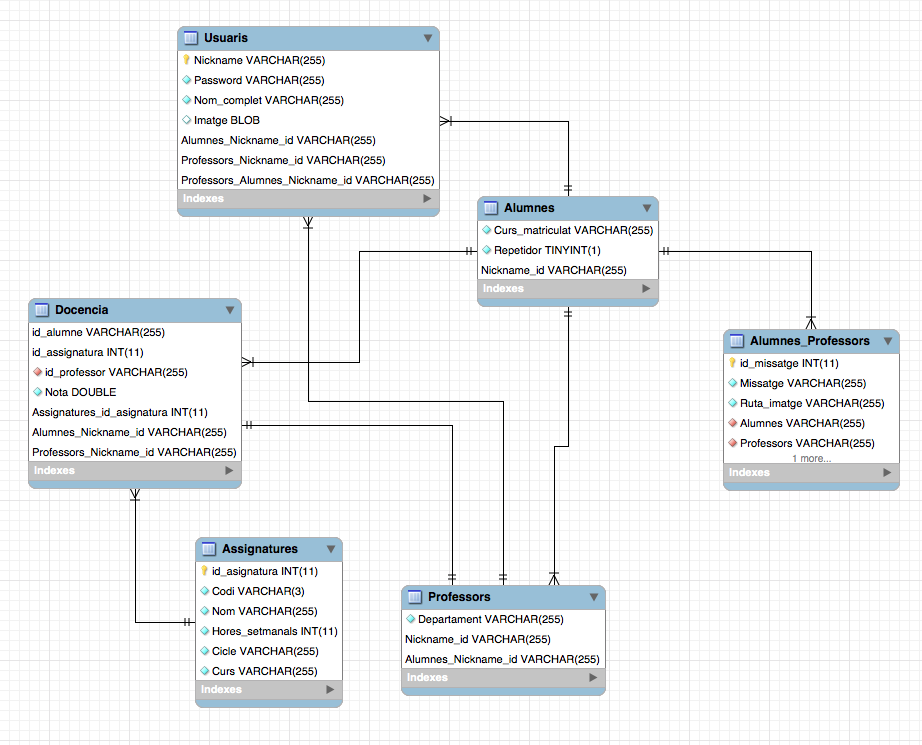

# Aplicación AD-DI
Esquema ER

## Usuarios
Para la gestion de los usuarios, he hecho una especializacion de alumnos y profesores, guardando de todos los usuarios un nombre de usuario, una contraseña, el nombre completo y una imagen que sera subida con blob. Todos los campos seran requeridos menos la imagen.

## Alumnos
De los alumnos guardaré en que curso están matriculados y si es repetidor, este ultimo valor con un boolean. Todos los campos requeridos.

## Profesores
De los profesores guardaré a que departamento pertenece, siendo este requerido también.

## Asignaturas
En las asignaturas guardaremos un codigo del módulo (que no será la clave primaria) limitado a 3 caracteres, el nombre completo, las horas semanales en un integer, el ciclo y el curso de la asignatura. Todos los campos seran requeridos y he hecho un nuevo campo llamado id_asignatura que sera la clave primaria.

## Docencia
Para guardar la docencia he hecho una relación ternaria entre profesor, alumno y asignatura. Puesto que no puedes haber dos profesores distintos dando la misma asignatura al mismo alumno, he hecho que alumno y asignatura sea la clave primaria. Tambien grabaremos la nota en un float y sera un campo requerido.

## Mensajería
Para crear una mensajeria he hecho una relación de muchos a muchos entre alumnos y profesores, guardandonos el mensaje y una imagen, siendo esta no requerida, ya que no siempre se enviaran imagenes entre si. La imagen no se guardará en la base de datos en tipo blob, si no que se recogera la ruta local y se guardará de esta manera.